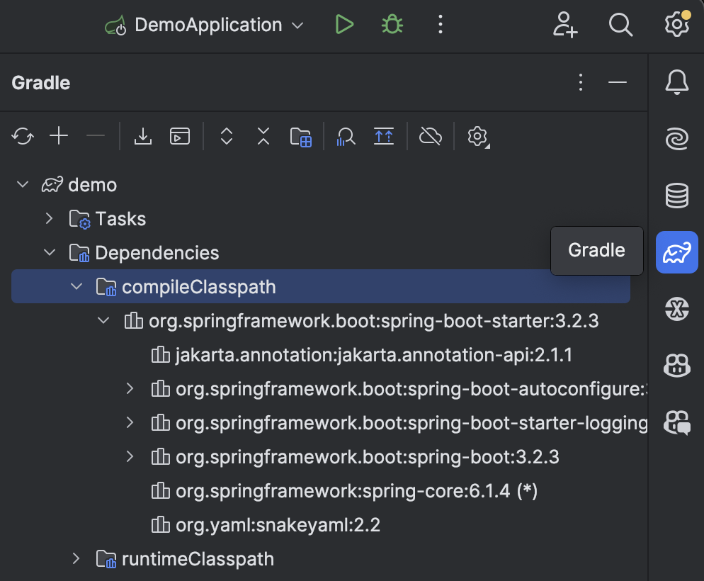

# Exercise 1

1. Enter [start.spring.io](https://start.spring.io/)
2. Use _Explore_ button to see what's get included
3. Experiment with options and see what changes
4. _Generate_, extract and open in IntelliJ
    * File ⇒ Open... ⇒ build.gradle ⇒ Open as Project
5. Check in the Gradle panel (at right) what dependencies got added and in which versions
    
6. Run `dependencyManagement` task
    * Tasks ⇒ help ⇒ dependencyManagement
    * `./gradlew dependencyManagement`
